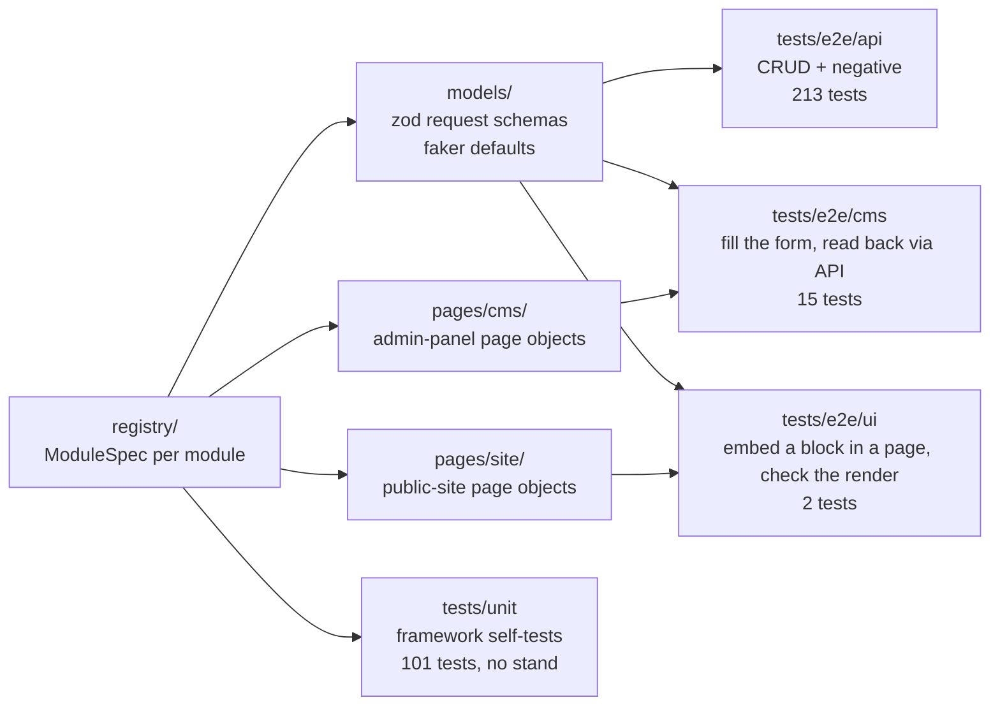

# auto_tests_ts

[](https://github.com/mkubekov/auto_tests_ts/actions/workflows/ci.yml)


A Playwright Test + TypeScript framework for testing a content CMS on three levels at once:
the **REST API**, the **admin panel** that edits the content, and the **public site** that
renders it. One registry entry describes a CMS module for all three layers, and every suite
is parametrised from that registry.

> **This is a TypeScript learning port of [cms-autotests](https://github.com/mkubekov/auto_tests),
> rewritten under TypeScript idioms.** The original is a Python / pytest / Playwright / Allure
> project. This repository rebuilds the same ideas (registry-driven parametrisation, Page
> Object Model, fake data as schema, cleanup stack, reference-data cache) with the tools the
> TypeScript ecosystem offers, and changes the design wherever those tools allow something
> better. It is not a line-by-line translation; see [Improvements](#improvements) for what
> changed and why.

The CMS under test is invented: banners, headers, footers, page-constructor blocks and so on,
with the same shape as the Python template and no tie to a real product.

## There is no test stand

Nothing in this repository has a live backend to run against. That splits the suite in two:

| Suite | Command | What "green" means |
|---|---|---|
| `tests/unit` — 101 framework self-tests | `pnpm test` | **Actually executed**, with real assertions and no network or browser |
| `tests/e2e` — 230 API / CMS / UI tests | `pnpm test:list` | **Type-checked and enumerated only.** `playwright test --list` proves that the registry parametrises into the expected test ids; no test body runs |

The e2e suites are written to run against a real stand (the manual `e2e.yml` workflow does
exactly that once secrets exist), but they have never been executed, and this README does not
claim they pass.

## How it works



* **API tests** post a generated payload, validate the response with its zod schema, and check
  that every field sent came back (`assertEcho`). Negative tests cover a missing API key,
  malformed bodies, duplicates, wrong routes and unsupported verbs, and require the error
  envelope.
* **CMS tests** open the admin form, fill it from the same payload, save, then read the entity
  back through the API and compare field by field.
* **UI tests** create a block and a page that embeds it through the API, then open the public
  page and check the rendered block.
* **Unit tests** cover the framework itself: settings, fake data, HTTP client, assertions,
  cleanup stack, reference data, registry consistency and payload round-trips.

All four are Playwright Test **projects** in `playwright.config.ts` and run through one binary,
one config and one HTML reporter.

## Quick start

```bash
pnpm install
cp .env.example .env              # placeholders are enough for --list

pnpm test                         # unit project: real run, no stand needed
pnpm test:list                    # api/cms/ui projects: enumerate, do not execute

pnpm build                        # tsc --noEmit, strict mode
pnpm lint                         # biome check .
pnpm format                       # biome format --write .
```

Against a real stand (fill `.env` with real URLs and credentials first):

```bash
pnpm exec playwright install --with-deps
pnpm exec playwright test --project=api
pnpm exec playwright test --project=cms --headed
BROWSER=firefox pnpm exec playwright test --project=ui
pnpm exec playwright show-report  # HTML report; failed tests carry a trace
```

`--browser` cannot be combined with a config that defines projects, so the browser for the
`cms` and `ui` projects comes from the `BROWSER` environment variable (`chromium` by default,
`firefox` or `webkit`). It is read from the shell, not from `.env`.

## Configuration

`src/config/settings.ts` validates the environment (and `.env`) with one zod schema. Loading is
lazy: importing the module never needs a configured environment, which is why the unit tests
and `--list` work with placeholder values. Every missing or invalid variable is reported in
one error, not one at a time.

| Variable | Required | Purpose |
|---|---|---|
| `API_BASE_URL` | yes | Content API root, e.g. `https://api.example.com/api/v3` |
| `CMS_BASE_URL` | yes | Admin panel root; forms open at `<CMS_BASE_URL>/<cmsPath>` |
| `CMS_API_BASE_URL` | no | Admin auth API (login/logout). Default `<CMS_BASE_URL>/api/v1` |
| `SITE_BASE_URL` | no | Public site root. UI tests are skipped when unset |
| `API_KEY` | yes | Sent as the `api-key` header |
| `CMS_EMAIL`, `CMS_PASSWORD` | yes | Admin account; each worker logs in once via the API |
| `TEST_PAGE_PATH` | no | Public page rendered by UI tests (default `/autotest`) |
| `VIEWPORT` | no | `WIDTHxHEIGHT`, default `1920x1080`; parsed straight into `{ width, height }` |
| `REMOTE_BROWSER_WS` | no | `ws://` endpoint of a Playwright server or grid; unset = local browser |
| `BROWSER_TIMEOUT_MS`, `CONNECT_TIMEOUT_S`, `READ_TIMEOUT_S` | no | Timeouts |
| `FAKER_LOCALE` | no | Locale for generated data, default `en_US` |
| `FAKER_SEED` | no | Fixed seed to replay a run's data |
| `GLOBAL_SEARCH_PATH` | no | Endpoint that finds entities by name; unset disables the end-of-run sweep |
| `BROWSER` | no | Shell only: `chromium`, `firefox` or `webkit` for the cms/ui projects |

## Project layout

```
src/
├── config/settings.ts        zod schema over process.env, lazy loadSettings()
├── data/                     seeded faker, run markers, UI labels, fixture file paths
├── models/                   zod request schemas, one file per module, grouped by area;
│                             every field has a faker .default(), so schema.parse({}) is a payload
├── http/
│   ├── apiClient.ts          ApiClient over Playwright's APIRequestContext (+ curl repro)
│   ├── assertions.ts         assertStatus / assertSchema / assertResponse / assertEcho
│   ├── cleanupStack.ts       delete what a test created, in reverse order, never throw
│   └── referenceData.ts      cached lookups of existing entities that payloads point at
├── registry/
│   ├── moduleSpec.ts         ModuleSpec<TSchema> + defineModule()
│   ├── modules.ts            the 16 registered modules
│   └── selectors.ts          apiModules / writableModules / cmsModules / pageBlockModules
├── pages/cms/                admin-panel page objects: CmsPage base, Ant Design components,
│                             one form per module
├── pages/site/               public-site page objects: SitePage base, page-constructor views
└── resources/                files for upload fields
tests/
├── unit/                     framework self-tests (project "unit")
└── e2e/
    ├── fixtures.ts           test.extend(): clients, cleanup, reference data, CMS session, pages
    ├── helpers.ts            createEntity(): POST, register cleanup, then assert
    ├── api/  cms/  ui/       the three suites, each a Playwright project
.github/
├── workflows/ci.yml          lint, typecheck, unit tests, e2e --list, secret scan
├── workflows/e2e.yml         manual real run against a stand
└── dependabot.yml
```

## Modules included

| Key | What it demonstrates |
|---|---|
| `webhooks` | The minimal module: two fields, schema + form + registry entry. Copy it to start a new one |
| `handbooks` | API-only module (no admin form); PATCH on a field other than `name` |
| `statistics` | Flat block with a list of homogeneous items and rich-text fields |
| `accordions` | Nested items, dropdown bound to a reference dictionary, colour scheme, buttons |
| `banners` | Two file uploads, multi-select targeting, switches, a conditional nested object |
| `promoBanners` | Colour picker, responsive image set, date period (CMS test skipped, reason in the registry) |
| `footerSections` → `footers` | An entity that references another entity by the whole object |
| `headerSubcategories` → `headerCategories` → `headers` | Three-level reference chain and a dedicated test for the non-standalone entity |
| `cities` | Tabbed form, repeated address sub-forms, custom submit button |
| `videoLessons` | Video widget in link mode, SEO meta, labels dictionary |
| `textBlocks`, `galleryBlocks` | Page-constructor blocks with a `blockType`, rendered on the public site |
| `pages` | The page template that composes blocks by type |

## Adding a module

A module is one schema, one form and **one registry entry**. The suites pick it up from the
registry; no test file changes.

1. **Schema** in `src/models/<group>/<name>.ts`: extend `baseFields` and give every field a
   default, so `schema.parse({})` produces a full random payload.

   ```ts
   export const webhookSchema = baseFields.extend({
     externalId: z.string().default(() => faker.helpers.replaceSymbols("EXT-####-####")),
     campaignCode: z.string().default(() => faker.helpers.replaceSymbols("CMP-####-####")),
   });
   ```

   A schema that needs existing entities (a category, a footer section) is a factory taking a
   `ReferenceSource` instead of reading a global.

2. **Admin form** in `src/pages/cms/<group>/<Name>.ts`: extend `CmsPage<Payload>` and implement
   `createElement(payload)` and `checkCreatedItem(payload, created)` with the primitives
   (`fill`, `switch`, `check`, `upload`, `clickDashed`) and components (`DropDown`,
   `TextEditor`, `Buttons`, `ColorPicker`, `Indexing`, `VideoLoader`).

3. **Register** it in `src/registry/modules.ts`:

   ```ts
   webhooks: defineModule({
     key: "webhooks",
     apiPath: "content/webhooks",
     schema: () => webhookSchema,
     cmsPath: "integrations/webhooks",
     CmsPageClass: cms.Webhook,
     patchField: "name",
   }),
   ```

   `defineModule` infers the schema type from `schema` and checks the rest of the entry
   against it: a `patchField` the schema does not have, or a form written for another
   module's payload, is a compile error.

4. Run `pnpm build && pnpm test`: the registry tests check that the entry is consistent and
   that the schema builds a payload that re-validates against itself. `pnpm test:list` then
   shows the new module's API and CMS tests.

If the admin form cannot be automated yet, set `cmsSkipReason`. The CMS test is then skipped
with `test.skip(condition, reason)`, so the reason shows up in the report instead of the module
silently disappearing.

## Improvements

Deliberate differences from the Python original. Code comments refer to these by number.

1. **Runtime validation TypeScript does not get for free.** `(await res.json()) as Foo` is
   an assertion the compiler cannot check. Python already knows the runtime type of a value,
   so pydantic there is extra safety; in TypeScript, zod is what makes a response body
   trustworthy at all. Every `assertSchema` / `assertResponse` closes a hole that exists by
   default.
2. **`ModuleSpec<TSchema>` is a real generic.** Python's `patch_field: str` and
   `cms_page: type[CmsPage]` accept anything. Here `patchField` is
   `keyof z.infer<TSchema>`, and `CmsPageClass` / `SitePageClass` are bound to that schema's
   payload type, so a typo or a mismatched form fails to compile at the registry entry rather
   than in a browser.
3. **No reporting layer.** The original needed its own attachments module plus `curlify`,
   because requests + pytest + Allure attach nothing by themselves. Playwright Test's
   `testInfo.attach()` and its trace viewer cover this; `ApiClient` only attaches a curl
   reproduction of each request.
4. **Traces instead of a screenshot on failure.** `trace: "retain-on-failure"` keeps a
   scrubbable timeline of the whole test: DOM before and after every action, the network log
   and the console. Strictly more to debug a CI failure with, for one line of config.
5. **Worker-scoped fixtures instead of a global singleton.** Python's `ReferenceData` lived
   in a module-level global with an override-and-restore context manager for tests. Here it is
   a `{ scope: "worker" }` fixture: one instance per worker, set up and torn down by the
   runner, and a unit test just passes a stub object.
6. **Suites are projects, not CLI paths plus flags.** Each suite's directory, browser and
   trace/screenshot/video policy is declared once in `playwright.config.ts`; CI only says
   `--project=api`.
7. **One runner for everything.** Unit and e2e tests share one binary, config and reporter,
   instead of pytest + pytest-playwright + pytest-xdist + pytest-rerunfailures + allure-pytest.
8. **One declaration for derived config.** Python kept `viewport: str` and a computed
   `viewport_size` property in sync by hand. The zod field validates the string and
   `.transform()`s it into `{ width, height }` at parse time.
9. **Typed, aggregated config errors.** `safeParse` reports every missing or invalid variable
   together, as a typed `ZodError` the caller can format, rather than an exception string.

Smaller changes of the same kind are noted in code comments where they happen: type guards
such as `hasCms()` narrow the modules a suite receives, so the Python suites' runtime
`assert module.cms_page is not None` disappears; the registry is a typed object literal, so
`moduleSpec("banerns")` does not compile.

## Design decisions kept from the original

* **Registry instead of discovery.** One typed entry per module replaces hand-maintained lists
  that drift apart, and unit tests verify each entry is complete.
* **Payloads come from the schemas.** Every field is generated at parse time, so tests never
  share data and a schema change is a one-line edit.
* **Reproducible randomness.** Faker is seeded; set `FAKER_SEED` to replay a run's data.
* **Run-scoped names.** Entities are named `autotest-<run id>-<suffix>`; the end-of-run sweep
  searches by that marker, so parallel workers and other people's runs on a shared stand are
  never touched.
* **Register before assert.** `createEntity` registers the new entity for cleanup before
  checking the response, so a failed assertion keeps its message and leaves nothing behind.
  `CleanupStack` deletes in reverse order (dependants first) and never throws.
* **Read back through the API.** CMS tests verify what the form saved by fetching the entity,
  not by trusting the UI.
* **A schema check alone is not enough.** Request schemas have defaults everywhere, so they
  accept an empty object; `assertEcho` adds the missing half, every field sent must come back.

## CI

* **`ci.yml`** (push and pull request): `pnpm install --frozen-lockfile`, Biome, `tsc --noEmit`,
  the unit project, and `playwright test --list` over the api/cms/ui projects with the
  placeholder `.env.example`: proof that the registry parametrises without a stand or
  installed browsers. A separate job runs a gitleaks secret scan.
* **`e2e.yml`** (manual dispatch): pick a suite, browser, viewport and optional Faker seed;
  stand URLs and credentials come from repository secrets. Installs browsers only for cms/ui,
  retries twice and uploads the HTML report and traces. It is inert until those secrets exist.
* **Dependabot**: monthly grouped updates for npm packages and GitHub Actions.

## Known limitations

* **The e2e suites have never run.** They are type-checked and enumerated, nothing more.
* **Locators are illustrative.** The admin-panel and site page objects target invented Ant
  Design markup (input `id` = API field path, numbered repeated rows, labelled uploaders);
  `src/pages/cms/index.ts` lists the assumptions. Expect to adjust them against a real panel.
* **Auth is an adapter point.** The `api-key` header and the cookie-based CMS login live in
  `src/http/apiClient.ts` and `tests/e2e/fixtures.ts`.
* **UI text** (`Save`, `Add`, dropdown labels) is centralised in `src/data/labels.ts`.

Possible next steps: a pre-commit hook (husky + lint-staged running Biome and `tsc`), the
equivalent of the original's pre-commit config; and `await using` with `Symbol.asyncDispose`
for `CleanupStack` once explicit resource management is stable in Node.

## License

MIT, see [LICENSE](LICENSE).
